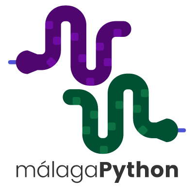
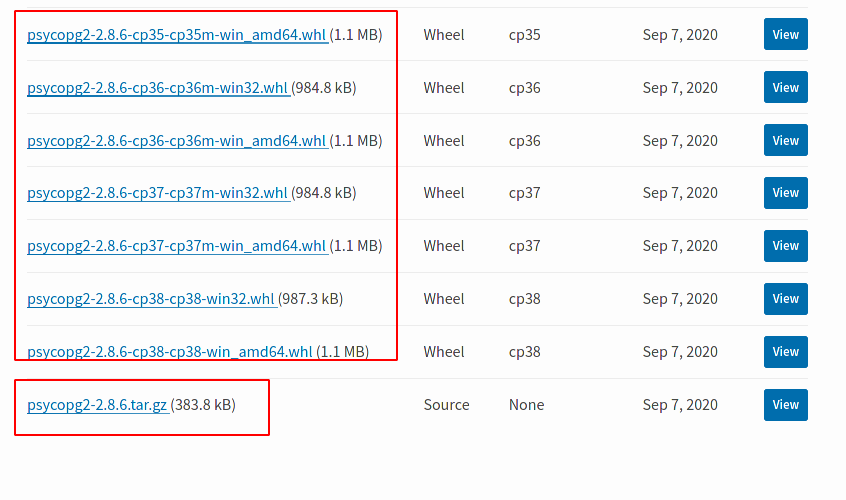
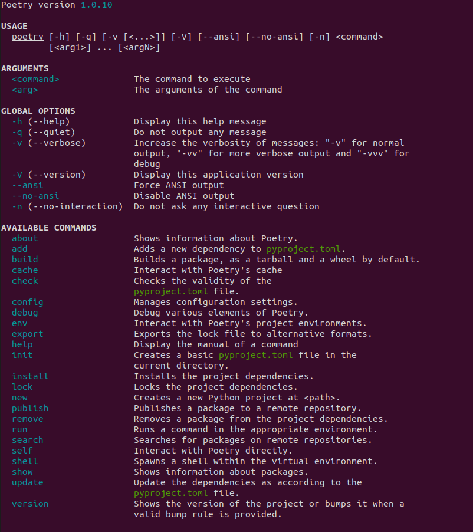

# Gestión de paquetes en Python con Poetry

-  @python_malaga
-  /es/python_malaga/
-  python_malaga


---

# wheels vs sdist

Actualmente, la distribucion de paquetes en python en PyPI se hace en dos formatos:

- **wheel**: es el "artefacto" o "producto final " que se va a instalar.

- **source distribution o sdist**: un fichero tar.gz con el codigo fuente y a partir del cual se va a poder crear la wheel.

---




---
La genracion se hace por medio de la libreria setuptools:

**sdist**:

```
python setup.py sdist
```

**wheel**:

```
python setup.py bdist_wheel
```

---

# Instalacion con pip

```bash
pip install psycopg2
```

- En caso de que haya una wheel para nuestro s.o., interprete, y arquitectura, pip descargara la wheel directamente de pypi.
- En caso contrario tendra que generarla a partir del sdist.
- Para generar la wheel, PIP ASUME QUE TENEMOS INSTALADAS las librerias `setuptools` y `wheel`.

---

# PEP 517 y PEP 518

Para evitar esta dependencia de setuptools hacen falta:

- Una especificacion de como crear una wheel a partir de un sdist (PEP 517)
- Especificar que paquetes hace falta tener instalados antes del proceso de build. Esto se hace por medio de un nuevo fichero `pyproject.toml` (PEP 518)

---

# Fichero pyproject.toml
De esta forma, podre seguir usando setuptools como hasta ahora:

```
[build-system]
requires = ["setuptools", "wheel"]
```

Pero tambien, podre usar otras herramientas, como poetry:


```
[build-system]
requires = ["poetry>=0.12"]
build-backend = "poetry.masonry.api"
```


---

# Poetry

"Poetry is a tool for dependency management and packaging in Python. It allows you to declare the libraries your project depends on and it will manage (install/update) them for you."

---

- Creado por Sébastien eustace @SDisPater
- Primera versión en Febrero 2018

---

### Requerimientos

- python 2.7 o python 3.5 (Multiplataforma)
---

### Características

- Pyproject.toml como fichero de dependencias
- Lock de dependencias
- Gestión de entornos virtuales
- Exportación de requirements.txt
- Shell Completition
- Python version management con pyenv
- Package publishing

---
## Instalación

```bash
pip install poetry
```
  o

```bash
curl -sSL https://raw.githubusercontent.com/python-poetry/poetry/master/get-poetry.py | python -
```
## Update
```bash
poetry self update
```

---

## Comandos



---

## Iniciamos proyecto

```bash
poetry new poetry-demo
```

## Si ya tenemos un proyecto y queremos incorporar poetry

```bash
cd pre-existing-project
poetry init
```

---
## Gestión de dependencias

- Modificar fichero pyproject.toml
```
[tool.poetry.dependencies]
requests = "^2.24.0"
```
- Usar comando poetry add

``` bash
poetry add requests
```
---

## Dev Dependencies

- Podemos crear dependencias sólo en entorno de desarrollo, no serán incluidas en el de construcción y despliegue
- Util para librerias de test, linters o de tipado estático
- Usamos el prefijo -D
```
poetry add -D flake8 mypy
```

---

## Entornos virtuales

- Poetry detectará si tenemos un entorno virtual y se asociará a el
- En caso de no tenerlo nos creará uno.
- Para ejecutar comandos en el entorno virtual tenemos varias formas
  
- Podemos lanzar comandos directamente
```
poetry run python my_script.py
```
- o podemos entrar directamente en la shell
```
poetry shell
```
---
## poetry.lock

- Previene de que siempre se instale la última versión de las dependincias
- Dentro del fichero lock se guarda una referehcia del fichero y de su hash code
```
requests = [
    {file = "requests-2.24.0-py2.py3-none-any.whl", hash = "sha256:fe75cc94a9443b9246fc7049224f75604b113c36acb93f87b80ed42c44cbb898"},
    {file = "requests-2.24.0.tar.gz", hash = "sha256:b3559a131db72c33ee969480840fff4bb6dd111de7dd27c8ee1f820f4f00231b"},
]

```

- Si quisieramos actualizarlo usariamos el comando poetry update.

```
poetry update
```
- Es muy recomendable incluir este fichero en el repositorio.


---
## Instalando dependencias

- Cuando ejecutamos el comando poetry install
- Instalación con poetry.lock
- Instalación sin poetry.lock

---
## Construyendo

Cuando queremos construir el proyecto simplemente usamos el comando poetry build, al estar todo configurado en el fichero pyproject.toml no tenemos necesidad de hacer mucho mas
- Construirá en sdist y wheel

```bash
poetry build
```

---
## Publicando

- Con el comando publish, publicamos el paquete

```
poetry publish
```
- Tenemos parámetros para escoger el repositorio ya sea publico (pypi index por defecto) o uno privado

- También podemos simular la publicación con el comando --dry-run
---


## Otros comandos útiles

- poetry config, nos ayuda a settear valores en el fichero de configuración
- poetry export, nos ayuda a exportar el requrements.txt
- poetry check, comprueba la estructura del pyproject.toml
- poetry search, busca paquetes en indices remotos, publicos o privados.

---
# DEMO