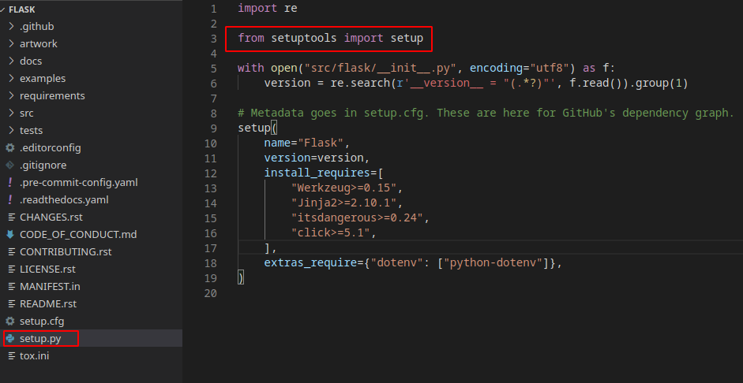
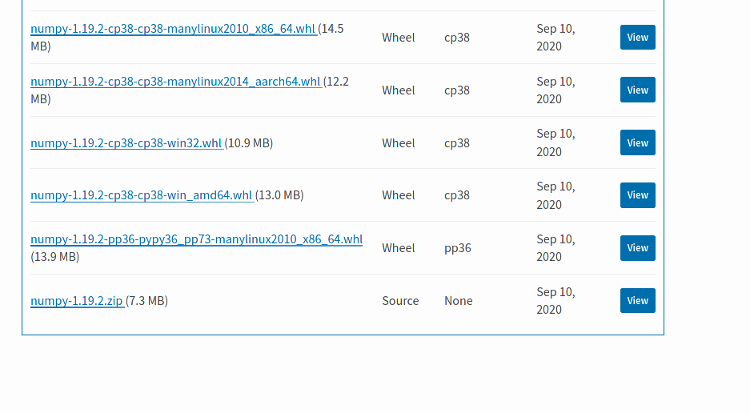

# Gestión de paquetes en Python con Poetry

-  @python_malaga
-  /es/python_malaga/
-  python_malaga


---
# Distribucion de paquetes en Python

- Es probable que en algun momento necesitemos distribuir un paquete de python a mas gente.

- Para facilitar el proceso de instalacion, Python proporciona herramientas de "empaquetado".

- La herramienta que hasta hace poco se podia utilizar es unicamente `setuptools`. 


---
# setuptools y el fichero setup.py

- Para distribuir un paquete usando `setuptools`, debemos proporcionar el fichero `setup.py` en la raiz de nuestro proyecto.

- Este fichero incluye la informacion necesaria para instalar el paquete, tal
como el numero de version, dependencias, etc.

---



---

# Formatos de empaquetado: wheels vs sdist

La distribucion de paquetes en python se puede hacer hace en dos formatos:

- **wheel**: es el "artefacto" o "producto final " que se instala. Tendremos que crear una wheel distina para combinacion de S.O., version de python y arquitectura el que se pueda instalar nuestro proyecto.

```
python setup.py bdist_wheel
```

- **source distribution o sdist**: un fichero tar.gz con el codigo fuente y metadatos a partir del cual se puede crear la wheel. 

```
python setup.py sdist
```

---

# Subida a Pypi

Tras ejecutar estos comandos tendremos una carpeta `dist` que contendra el paquete que hemos creado con los comandos anteriores (tanto la wheel como el sdist).

Una vez hemos generado las distribuciones, estariamos en disposicion de subir nuestro proyecto a pypi usando otra herramienta, twine:

```
twine upload my_project dist/*
```

---

# Ejemplo: libreria numpy en pypi

[numpy](https://pypi.org/project/numpy/#files)



---

# Instalacion de un paquete con pip


Que sucede cuando instalo por ejemplo `numpy`?

```bash
pip install numpy
```

1. `pip` se conecta a `pypi` e intenta descargarse una wheel compatible con nuestro sistema.
2. Si existe una `wheel`, se la descarga y la instala en nuestro sistema.
3. En caso de no existir, `pip` se descargara la distribucion  en formato `sdist` y tendra que general la wheel en nuestro sistema despues.

---

Para generar la `wheel` en nuestro sistema PIP ASUME QUE TENEMOS INSTALADA localmente la libreria `setuptools`.

- `setuptools` no forma parte de la libreria estandar.
- Si quiero usar otra herramienta para generar wheels distinta de `setuptools` es un problema.

---

# PEP 517 y PEP 518

Para evitar esta dependencia de setuptools hacen falta:

- Una especificacion de como crear una wheel a partir de un sdist (PEP 517)
- Especificar que paquetes hace falta tener instalados antes del proceso de build. Esto se hace por medio de un nuevo fichero `pyproject.toml` (PEP 518)

---

# Fichero pyproject.toml

De esta forma, podre seguir usando setuptools como hasta ahora:

```
[build-system]
requires = ["setuptools", "wheel"]
```

Pero tambien, podre usar otras herramientas, como poetry:

```
[build-system]
requires = ["poetry>=0.12"]
build-backend = "poetry.masonry.api"
```

---
# Una herramienta para gobernarlos a todos
Aparte de todo el proceso que hay que hacer para distribuir un paquete en pypi, durante el proceso de desarrollo tenemos que lidiar con:

- entornos virtuales (virtualenv, pipenv)
- distinas versiones de interpretes (pyenv)
- gestion de dependencias en (requirements.txt y en setup.py)
- configuracion de herramientas diversas(flake8, pytest, etc..)

Todo esto implica ficheros de configuacion distintos, comandos distintos, opciones distintas, etc..

¿No molaria poder usar la misma herramienta para gestionarlo todo? Pues ya se puede con `poetry`

---

# Poetry

"Poetry is a tool for dependency management and packaging in Python. It allows you to declare the libraries your project depends on and it will manage (install/update) them for you."

---

- Creado por Sébastien eustace @SDisPater
- Primera versión en Febrero 2018

---

### Requerimientos

- python 2.7 o python 3.5 (Multiplataforma)
---

### Características

- Pyproject.toml como fichero de dependencias
- Lock de dependencias
- Gestión de entornos virtuales
- Exportación de requirements.txt
- Shell Completition
- Python version management con pyenv
- Package publishing

---
## Instalación

```bash
pip install poetry
```
  o

```bash
curl -sSL https://raw.githubusercontent.com/python-poetry/poetry/master/get-poetry.py | python -
```
## Update
```bash
poetry self update
```

---

## Comandos


---

## Iniciamos proyecto

```bash
poetry new poetry-demo
```

## Si ya tenemos un proyecto y queremos incorporar poetry

```bash
cd pre-existing-project
poetry init
```

---
## Gestión de dependencias

- Modificar fichero pyproject.toml
```
[tool.poetry.dependencies]
requests = "^2.24.0"
```
- Usar comando poetry add

``` bash
poetry add requests
```
---

## Dev Dependencies

- Podemos crear dependencias sólo en entorno de desarrollo, no serán incluidas en el de construcción y despliegue
- Util para librerias de test, linters o de tipado estático
- Usamos el prefijo -D
```
poetry add -D flake8 mypy
```

---

## Entornos virtuales

- Poetry detectará si tenemos un entorno virtual y se asociará a el
- En caso de no tenerlo nos creará uno.
- Para ejecutar comandos en el entorno virtual tenemos varias formas
  
- Podemos lanzar comandos directamente
```
poetry run python my_script.py
```
- o podemos entrar directamente en la shell
```
poetry shell
```
---
## poetry.lock

- Previene de que siempre se instale la última versión de las dependincias
- Dentro del fichero lock se guarda una referehcia del fichero y de su hash code
```
requests = [
    {file = "requests-2.24.0-py2.py3-none-any.whl", hash = "sha256:fe75cc94a9443b9246fc7049224f75604b113c36acb93f87b80ed42c44cbb898"},
    {file = "requests-2.24.0.tar.gz", hash = "sha256:b3559a131db72c33ee969480840fff4bb6dd111de7dd27c8ee1f820f4f00231b"},
]

```

- Si quisieramos actualizarlo usariamos el comando poetry update.

```
poetry update
```
- Es muy recomendable incluir este fichero en el repositorio.


---
## Instalando dependencias

- Cuando ejecutamos el comando poetry install
- Instalación con poetry.lock
- Instalación sin poetry.lock

---
## Construyendo

Cuando queremos construir el proyecto simplemente usamos el comando poetry build, al estar todo configurado en el fichero pyproject.toml no tenemos necesidad de hacer mucho mas
- Construirá en sdist y wheel

```bash
poetry build
```

---
## Publicando

- Con el comando publish, publicamos el paquete

```
poetry publish
```
- Tenemos parámetros para escoger el repositorio ya sea publico (pypi index por defecto) o uno privado

- También podemos simular la publicación con el comando --dry-run
---


## Otros comandos útiles

- poetry config, nos ayuda a settear valores en el fichero de configuración
- poetry export, nos ayuda a exportar el requrements.txt
- poetry check, comprueba la estructura del pyproject.toml
- poetry search, busca paquetes en indices remotos, publicos o privados.

---
# DEMO
