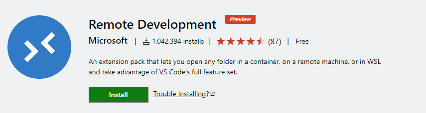

# Entorno de desarrollo Python con Docker y VS Code

-  @python_malaga
-  /es/python_malaga/
-  python_malaga

---

# Remote Development Extension en VS Code

Funcionalidad reciente (mayo 2019) de VS Code por la cual se puede conectar a entornos remotos.

https://code.visualstudio.com/blogs/2019/05/02/remote-development

- Remote - SSH. Permite conectarse a servidores remotos por SSH
- Remote - WSL. Permite usar VS Code directamente con WSL en Windows
- Remote - Containers. Permite usar un contenedor como entorno de desarrollo.

---

# Remote Development extensions en VSCode

A diferencia de VS Code, estas extensiones NO son código abierto.

(Pero son gratis...)

---

# Extension Remote - Containers
- Esta extensión inicia un contenedor de forma automática y será usado por VSCode como entorno de desarrollo.
- Mediante un fichero de configuración `devcontainer.json` dentro de nuestro proyecto especificamos que imagen se debe utilizar para iniciar el contenedor
- Además podemos especficar otros aspectos del entorno de desarrollo, como la configuración adicional de VS Code y otras extensiones que se desean utilizar

---

# Principales ventajas
- Entornos de desarrollo reproducibles.
- Facilitamos a nuevos miembros del equipo un entorno de desarrollo COMPLETAMENTE CONFIGURADO tras clonar el proyecto.
- Podemos probar nuevos "stacks" o proyectos sin necesidad de instalar cosas en nuestro equipo.

