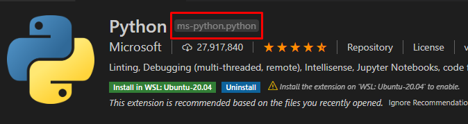
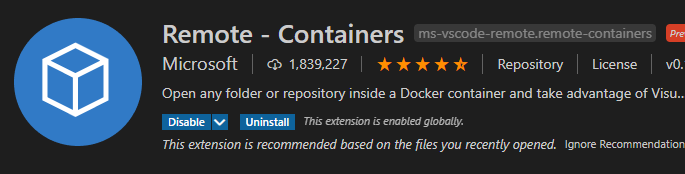

# Entorno de desarrollo Python con Docker y VS Code

-  @python_malaga
-  /es/python_malaga/
-  python_malaga

---

# ¿Que es un contenedor?

- Un contenedor es un empaquetado de código y todas sus dependencias para que la aplicación se ejecute de forma rápida y fiable de un entorno informático a otro.

---

# ¿Que es una Imágen de contenedor?

- La imagen de contenedor de Docker es un paquete de software ligero, independiente y ejecutable que incluye todo lo necesario para ejecutar una aplicación: código, tiempo de ejecución, herramientas del sistema, bibliotecas del sistema y configuraciones.

---

# ¿Como podemos trabajar con docker?

Local: Podemos crearnos nuestras imágenes con dockerfiles en local

Distribuida: Podemos subir nuestras imágenes a registros remotos para combinarlas con otras imágenes y desplegarlas en intraestructuras mas complejas.

---

# Creando un contenedor

### Dockerfile

```
FROM python:3.8

WORKDIR /usr/src/app

COPY requirements.txt ./
RUN pip install --no-cache-dir -r requirements.txt

COPY . .

CMD [ "python", "./your-daemon-or-script.py" ]
```

---

### Linea de comandos

```
docker run -it --rm --name my-running-script -v "$PWD":/usr/src/myapp -w /usr/src/myapp python:3 python your-daemon-or-script.py
```

- -name: Nombre del contenedor
- -v: volumen mapeado
- -w: Workdir, o espacio donde se va a situar el contenedor

---

### Multiples comandos

- docker run: crea un contenedor a partir de una imágen y lo ejecuta
- docker build: construye una imágen a partir de un dockerfile
- docker attach: nos conectamos al input outpout de un contenedor
- docker exec: ejecuta un comando dentro de un contenedor
- docker pull: hace pull desde un registro de imágenes para actualizar una imágen de contenedor
- docker push: Sube a un registry remoto la imagen o actualización de la imágen que hemos creado

---

# Pero yo quiero mas contenedores!


---

# Pero yo quiero mas contenedores!

- Base de datos
- Frontend
- Backend
- Redis
- Servidor web
- Balanceador de carga
- MongoDB
- Logstash
- Elasticsearch
- Kibana

---

# Pero yo quiero mas contenedores!

- Para orquestar mas contenedores necesitamos una herramienta como docker-compose

```
version: "3.8"

services:
  db:
    image: postgres
    environment:
      - POSTGRES_DB=postgres
      - POSTGRES_USER=postgres
      - POSTGRES_PASSWORD=postgres
  web:
    build: .
    command: python manage.py runserver 0.0.0.0:8000
    volumes:
      - .:/code
    ports:
      - "8000:8000"
    depends_on:
      - db
```

---

# Docker-compose

- Services: Nombre de los servicios que vamos a usar.
- image: Imagen de docker que va a ejecutarse en el contenedor
- build: En caso de que tengamos un dockerfile local, la ruta en la que se encuentra
- volumes: Nos permite mapear volumenes locales dentro del contenedor
- ports: Mapea puertos externos a puertos dentro del contenedor
- command: Una vez iniciado el contenedor, ejecuta el comando que indiquemos

---

# VS Code

- Editor gratuito (y open source) multiplataforma de Microsoft.
- Configuración mediante un fichero `settings.json`
- Permite aumentar su funcionalidad por medio de extensiones.
- Dispone de un depurador integrado.

---

# Depurador integrado de VS Code

- VS Code dispone de un depurador integrado.
- Este depurador incialmente soporta node.js y typescript
- Mediante extensiones se da soporte a más lenguajes.

---

# Extensiones para desarrollo en python y docker

- Python



- Remote Containers



---

# Python Extension

- Autocompletado
- Linting
- Formato de código
- Soporte para el depurador de VS Code

---

# Remote Development Extension en VS Code

Funcionalidad reciente (mayo 2019) de VS Code por la cual se puede conectar a entornos remotos.

https://code.visualstudio.com/blogs/2019/05/02/remote-development

- Remote - SSH. Permite conectarse a servidores remotos por SSH
- Remote - WSL. Permite usar VS Code directamente con WSL en Windows
- Remote - Containers. Permite usar un contenedor como entorno de desarrollo.

---

# Remote Development extensions en VSCode

A diferencia de VS Code, estas extensiones NO son open source.

(Pero se pueden usar de forma gratuita...)

---

# Extension Remote - Containers

- Esta extensión inicia un contenedor de forma automática y será usado por VSCode como entorno de desarrollo.
- Mediante un fichero de configuración `devcontainer.json` dentro de nuestro proyecto especificamos que imagen se debe utilizar para iniciar el contenedor
- Además podemos especficar otros aspectos del entorno de desarrollo, como la configuración adicional de VS Code y otras extensiones que se desean utilizar

---

# Principales ventajas

- Entornos de desarrollo reproducibles.
- Facilitamos a nuevos miembros del equipo un entorno de desarrollo COMPLETAMENTE CONFIGURADO tras clonar el proyecto.
- Podemos probar nuevos "stacks" o proyectos sin necesidad de instalar cosas en nuestro equipo.

---

---

# DEMO
